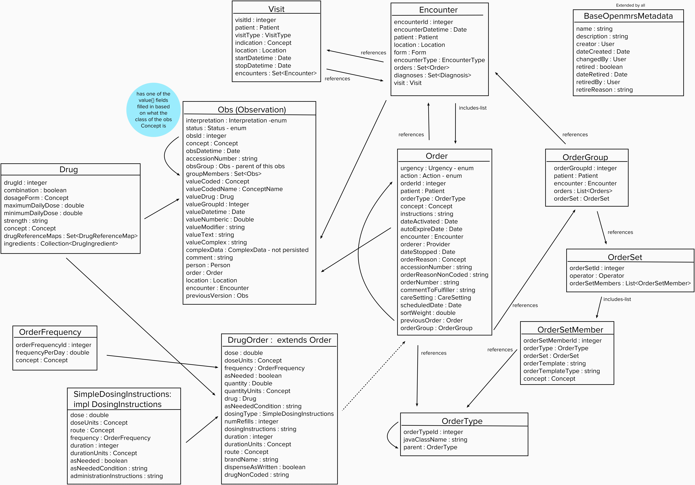
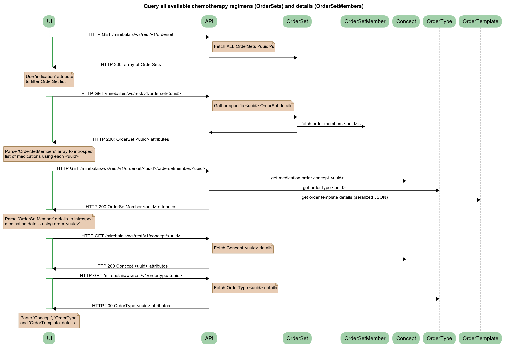
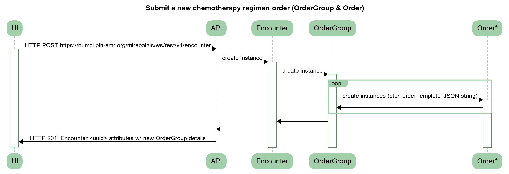
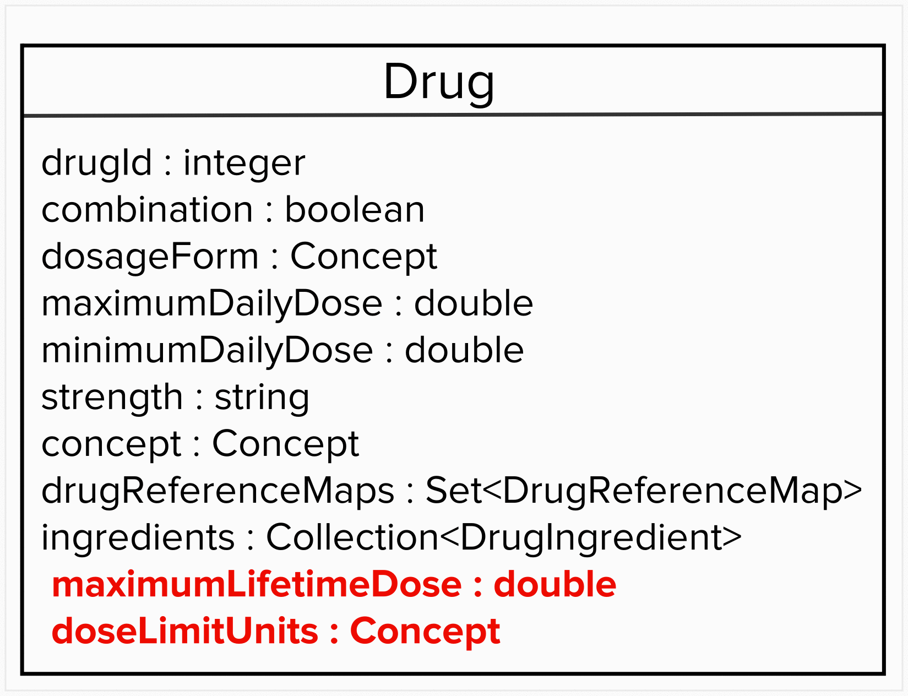
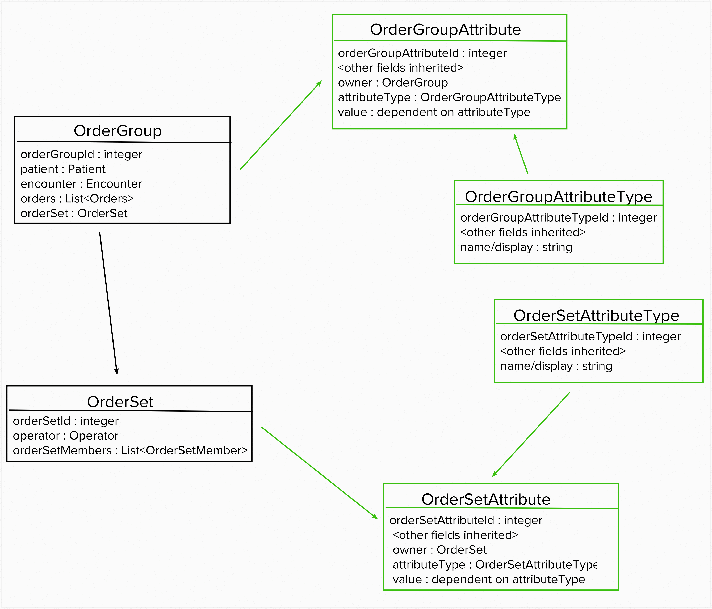
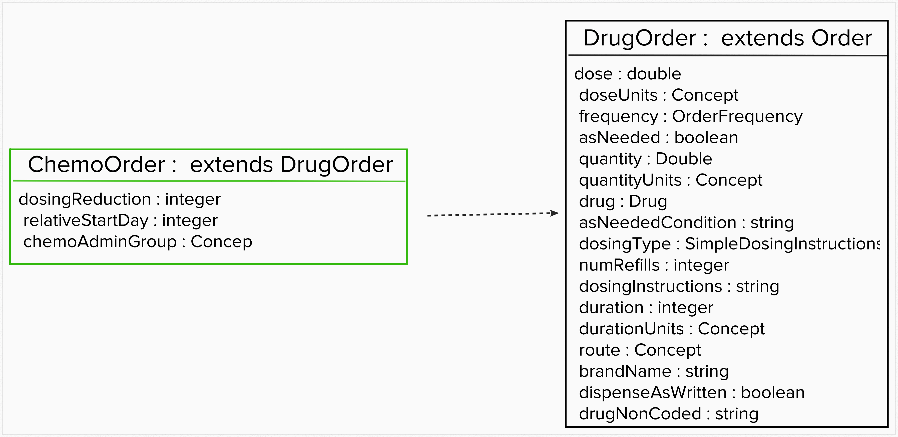

OpenMRS 2.1.3 Mirebalais: Oncology Regimen Ordering & Dashboard Support
=======================================================================

- [OpenMRS 2.1.3 Mirebalais: Oncology Regimen Ordering & Dashboard Support](#openmrs-213-mirebalais--oncology-regimen-ordering---dashboard-support)
  * [Purpose](#purpose)
  * [Context](#context)
  * [Assumptions](#assumptions)
- [Functional Requirements](#functional-requirements)
- [Use Cases](#use-cases)
- [Technical Flows](#technical-flows)
  * [DR_UC1 - Select chemotherapy regimen from list](#dr-uc1---select-chemotherapy-regimen-from-list)
  * [DR_UC2 - Submit an order for the selected chemotherapy regimen in DR_UC1 use case](#dr-uc2---submit-an-order-for-the-selected-chemotherapy-regimen-in-dr-uc1-use-case)
  * [OT_UC1 - Authoring an oncology regimen templates for use in EMR solution](#ot-uc1---authoring-an-oncology-regimen-templates-for-use-in-emr-solution)
- [Proposal](#proposal)
- [Extended Content](#extended-content)
- [Technical TODOs/Open Issues](#technical-todos-open-issues)

Purpose
-------

This document captures options gathered during first week of discussions about how to implement ordering of oncology (chemo specifcally) treatment regimens within OpenMRS Mirebalais distro and provide dashboard analytics about their treatment.


Context
-------

This capability is being added as part of a 3-week on-site engagement between PIH and IBM teams. The goal is to provide a completed set of features for use with Mirebalais distro. 

The scope was focused on doctor-centric workflow during initial consultation/diagnosis of a cancer patient which requires doctor order chemotherapy treatment which is likely to be recurring and re-validated during each cycle visit.

This doctor workflow's use cases are not currently part of Mirebalais distro are:
- Order a chemo treatment from a well-known list of oncology regimens (i.e. templates), this includes ability to adjust drug values before submitting final order.
- Modify chemo treatment - after initial ordering - if needed based on doctor's assessment of patient's reaction to treatment regimen.
- Review patient's historical (dashboard) oncology treatment data (i.e. longitudinal view) when needed.


Assumptions
-----------

- OpenMRS 2.1.3 (or higher) platform w/ Mirebalais distro deployment (i.e. concept dictionary, modules, UI, etc).
- Oncology regimens supported in this effort will (at a minimum) cover the scope of Haiti's chemotherapy treatment forms provided:
    - 5FULeucovorin.pptx
    - AC.pptx
    - CarboTaxol.pptx
    - CHOP.pptx
    - CMF.pptx
    - COP.pptx
    - Cyclophosphamide Single Agent.pptx
    - Doxorubicin20.pptx
    - Doxorubicin60.pptx
    - Paclitaxel80.pptx
    - Paclitaxel175.pptx
    - Paclitaxel175ReChallenge.pptx
- Dictionary dataset (i.e. concepts and related metadata) might (and can) be modified using PIH dataset process.
- Data model could be extended or modified, if needed.


Functional Requirements
=======================

The updated system with oncology treatment ordering capability will leverage existing data model objects and api semantics as much as possible. There is already a substantial coverage of required modeling for supporting oncology regimens. Data concepts such as `OrderSet`, `OrderGroup`, and `Order` provide base for most of the above data interactions.


Use Cases
=========

**Doctor (DR)** use cases (primary data model classes involved are `Patient`, `OrderGroup`, `Order`, `OrderSet`, `OrderSetMember`, `OrderType`, `Encounter`):
- DR_UC1: As a doctor, I want to select and edit a chemotherapy regimen from a pre-configured set available during ordering.
- DR_UC2: As a doctor, I want to submit an order for the selected chemotherapy regimen in DR_UC1 use case.
- DR_UC3: As a doctor, I want to modify chemotherapy regimen *initially ordered* for a patient (i.e. before final order confirmation).
- DR_UC4: As a doctor, I want to modify chemotherapy regimen *previously ordered* for a patient (i.e. order is already in data model)

---

**Adminstrative (AD)** use cases (primary data model classes involved are):
- AD_UC1: As a nurse, I want to capture chemotherapy delivery observations for treatment cycle received on a specific visit.
- AD_UC2: As a nurse, I want to ...

---

**Order Templates (OT)** use cases (primary data model classes involved are `OrderSet`, `OrderSetMember`, `OrderType`):
- OT_UC1: As an oncology clinician, I want to author oncology regimen templates for use in EMR solution.
- OT_UC2: As an oncology clinician, I want to update an existing oncology regimen template currently in use in EMR solution.

---


Technical Flows
===============

- Data Model: 


DR_UC1 - Select chemotherapy regimen from list 
------

- Summary flow:
  1. Query all `OrderSet` templates available, returns array
  2. For each `OrderSet` in array above, query each `OrderSet`, `OrderSetMember`, `Concept`, `OrderType`, `OrderTemplate` detail attributes
  3. Use `OrderSet` indication attribute to group regimen classifications (i.e. "Chemotherapy" vs. "HIV")

- Implementation notes: Data encoded in `OrderSetMember.orderTemplate` is a seralized escaped JSON string that must be decoded in presentation later to understand data. When creating `Order` objects in the next use case, the final JSON string must be serialized similarly containing the updated (if applicable) chemotherapy drugs being ordered by doctor in final initial order.

- Sequence Diagram:  


- Data Model References:  
 [Class Diagram](#data-model)  
 [OrderSet object](https://docs.openmrs.org/doc/org/openmrs/OrderSet.html)  
 [OrderSet serialization](https://docs.openmrs.org/doc/serialized-form.html#org.openmrs.OrderSet)  

- Samples:  
  
request: `GET http://humci.pih-emr.org:443/mirebalais/ws/rest/v1/orderset`  
response: HTTP 200 [body](samples/get-ordersets-response.json)  
  
request: `GET https://humci.pih-emr.org:443/mirebalais/ws/rest/v1/orderset/c1c121bf-c660-4435-bdcf-04ac6e99c870`  
response: HTTP 200 [body](samples/get-orderset-chop-response.json)  
  
request: `GET https://humci.pih-emr.org:443/mirebalais/ws/rest/v1/orderset/c1c121bf-c660-4435-bdcf-04ac6e99c870/ordersetmember/2ab90f6b-83c3-4278-8dcb-aa9480f07d01`  
response: HTTP 200 [body](samples/get-ordersetmember-response.json)  
  
  
DR_UC2 - Submit an order for the selected chemotherapy regimen in DR_UC1 use case
------

- Summary flow:
  1. Get the current `Provider` (based on who is logged in, get from the session)
  2. Get the `EncounterRole` (this will be fixed for all orders, so just need a hard coded query) `https://humci.pih-emr.org/mirebalais/ws/rest/v1/encounterrole?q=Ordering%20Provider`
  3. Get the `Encounter` type (fixed again, need a hard coded query) `https://humci.pih-emr.org/mirebalais/ws/rest/v1/encountertype?q=Test%20Order`
  4. Get the current `Location` (get from the session)
  5. Get the `Patient` ID (hopefully this comes from the page/url that we are given)
  6. Construct the `OrderGroup` and `Order` objects and submit as described below

- Implementation notes: Response from the `POST /mirebalais/ws/rest/v1/encounter` request returns the same document submitted but with more of the fields completed, e.g. the UUID for the Encounter which has just been created. encounter role is a description of the type of person who is involved in the encounter (e.g. nurse) For existing drug orders, it looks like this is retreived with a query to `https://humci.pih-emr.org/mirebalais/ws/rest/v1/encounterrole?q=Ordering%20Provider`. Provider looks like a wrapper around person - not sure how to get this.

- Sequence Diagram


- Data Model References:
[Class Diagram](#data-model)  
[OrderSet object](https://docs.openmrs.org/doc/org/openmrs/OrderSet.html)  
[OrderSet serialization](https://docs.openmrs.org/doc/serialized-form.html#org.openmrs.OrderSet)  

- Samples:  
  
request: 
response: 

---

OT_UC1 - Authoring an oncology regimen templates for use in EMR solution
------

- Summary flow:
  1. Download and rename one of the existing regimens available from this repo folder: ([here](https://github.com/dearmasm/openmrs-module-oncology/edit/master/regimens)).
  2. Edit newly created regimen definition file to contain the new chemotherapy treatment orders and dosages (premedications drugs, chemo drugs, post medication drugs).
  3. Use Regimen Automation Management (YAAR) tool ([here](https://github.com/dearmasm/openmrs-module-oncology/edit/master/utils)) to validate and test your new chemotherapy regimen definition.
  4. Save new chemotherapy regimen into your OpenMRS module repo/project leverage YAAR tool for deploying regimens onto target system (note the just-in-time UUID lookup logic that the tool allows for supporting portable drug concepts)

- Usage information for **`Yet Another Automated Regimen (YAAR)`** management tool:
  
  - First, you must create an YAAR tool *server configuration file* to provide the YAAR tool with the required OpenMRS server api endpoint connectivity parameters. 
  You can use the `*.conf` examples available in this project's [/util](https://github.com/dearmasm/openmrs-module-oncology/edit/master/utils) directory as starting templates.
     ```yaml
     $ cat localhost-server.conf 
     # YAAR tool configuration file (YAML format)
     # author: Mario De Armas
     # date: 2018.08.03
     #
     # This file contains target OpenMRS server for use with YAAR utility:
     hostURL: "http://localhost:8080/openmrs"
     apiEndpoint: "/ws/rest/v1"
     userID: "admin"
     password: "Admin123"
     ```
     ```bash
     $cp localhost-server.conf myhost-server.conf
     
     $vi myhost-server.conf
     ```
     Edit new file and add your specific OpenMRS host connectivity details - which will be used later as a YAAR tool parameter file. 
     
     
  - BASIC USAGE INFO 
     ```bash
     $ ./yaar.sh
     OPENMRS REGIMEN ORDERSET TOOL v1.0 (20180803)...
     [INFO] usage: yaar -add <config-file> <input-file>
                   yaar -get <config-file> [<uuid>]
                   yaar -update <config-file> <input-file> <uuid>
                   yaar -retire <config-file> <uuid>
     ```  
     
      HTTP CODE | Notes |
     --- | --- |
      *`200`* | Regimen instance (`OrderSet`) was udpated or returned (depending on YAAR action command executed)
      *`201`* | New regimen instance (`OrderSet`) was created (it will have a unique UUID)      
      *`400`* | Problem with the new regimen metadata or POST request structure is invalid, enable YAAR debugging and review error detail
      *`500`* | Problem with OpenMRS server processing request, check server instance logs for insight
      
  - Enabling Debugging  
     The tool allows for debugging mode to be enabled by appending `+d` to tool action name. So, for example, `-add` becomes `-add+d` to enable debugging for that command execution instance.  
     Here is table with quick look up for enabling debug mode for the different action parameters tool supports: 
      No Debug | Debug Mode |
     --- | --- |
      `-add` | `-add+d`
      `-get` | `-get+d`
      `-update` | `-update+d`
      `-retire` | `-retire+d`  
  
  

  - **`ADD`** (create new instance) a new regimen `OrderSet` on a target OpenMRS solution instance
     ```bash
     $ ./yaar.sh -add <openmrs-server.conf> <regimen-input-file>
     ```
 
  - **`GET all`** (existing) regimen `OrderSet` instances metadata from a target OpenMRS solution instance 
     ```bash
     $ ./yaar.sh -get <openmrs-server.conf>
     ```

  - **`GET`** a specific (existing) regimen `OrderSet` instance metadata from a target OpenMRS solution instance 
     ```bash
     $ ./yaar.sh -get <openmrs-server.conf> <regimen-uuid>
     ```

  - **`UPDATE`** an existing regimen `OrderSet` instance on a target OpenMRS solution instance 
     ```bash session
     $ ./yaar.sh -update <openmrs-server.conf> <regimen-input-file> <regimen-uuid>
     ```

  - **`RETIRE`** an existing regimen `OrderSet` instance from a target OpenMRS solution instance 
     ```bash session
     $ ./yaar.sh -retire <openmrs-server.conf> <regimen-uuid>
     ```
  
  
- Implementation notes:  

    - The tool is written in `Python 3` language. The key implementation file is [yaar.py](https://github.com/dearmasm/openmrs-module-oncology/edit/master/utils/yaar.py). There is a bash-friendly convenience wrapper included [yaar.sh](https://github.com/dearmasm/openmrs-module-oncology/edit/master/utils/yaar.sh) that can be used to launch YAAR tool without having to type `python yaar.py` every time.  
    
    - The tool supports drug concepts UUID look ups and building the `OrderSet` HTTP body requests dynamically to match API/object structure (specifically it will encode order set list members properly and append new chemo order set attribute extensions added by IBM+PIH chemo treatment project).  
    
    - The tool uses several specialized Python package libraries which will usually require installing manually (see next section on tool requisites).  
    


- Requisites:
  - MacOS (Mavericks or higher) instructions:
    1. install python 2.7 or higher, test that you can run it from command-line (type ```exit()``` to quit python prompt)
       ```
          ibmmacbookmario:utils dearmasm$ python
          Python 2.7.10 (default, Oct  6 2017, 22:29:07) 
          [GCC 4.2.1 Compatible Apple LLVM 9.0.0 (clang-900.0.31)] on darwin
          Type "help", "copyright", "credits" or "license" for more information.
          >>>
    2. install python yaml and requests libraries 
       ```
          sudo easy_install pip
          brew install libyaml
          sudo python -m easy_install pyyaml
          sudo pip install requests
          sudo pip install objdict
          sudo pip install enum
       
    3. test python+yaml lib is working
       ```
          ibmmacbookmario:utils dearmasm$ ls -l test.*
          -rw-r--r--  1 dearmasm  staff  96 Jul 23 09:52 test.py
          -rw-r--r--  1 dearmasm  staff  45 Jul 23 09:13 test.yaml
          ibmmacbookmario:utils dearmasm$ python test.py
          Hello World!
          {'hello': {'go': True, 'world': 123, 'here': 'we'}}

- Linux (Ubuntu or similar) instructions:
    1. install python 2.7 or higher, test that you can run it from command-line (type ```exit()``` to quit python prompt)
       
    2. install python yaml and requests libraries 
       ```
          sudo apt install python-setuptools
          sudo easy_install pip
          sudo python -m easy_install pyyaml
          sudo pip install requests
          sudo pip install objdict
          sudo pip install enum
       
    3. test python+yaml lib is working
       ```
          $ ls -l test.*
          -rw-r--r--  1 dearmasm  staff  96 Jul 23 09:52 test.py
          -rw-r--r--  1 dearmasm  staff  45 Jul 23 09:13 test.yaml
          $ python test.py
          Hello World!
          {'hello': {'go': True, 'world': 123, 'here': 'we'}}


- Sequence Diagram


- Samples:  
  
OT_UC2 - Editing an oncology regimen templates currently in use in an EMR solution
------


- Summary flow:
  1. There is chemotherapy regimen currently in use in an OpenMRS instance and it needs to be updated (for example, add/remove drug treatment detail or cycle information).
  2. Using YAAR tool (or other method), find the `UUID` for chemotherapy regimen `OrderSet` object instance you want to update.
  3. Edit regimen input file associated with `OrderSet` template you want to target.
  4. Apply changes to existing regimen using YAAR tool `UPDATE` capability (described in OT_UC1 section).
  5. Using YAAR tool (or other method), review updates applied to chemotherapy regimen `OrderSet` `UUID` object instance you provided in prior step.  
    
    
 - Usage Example:  
   
   - Fetch all regimens (i.e. all non-retired `OrderSet`s) in an OpenMRS system
     ```bash session
     $ ./yaar.sh -get localhost-server.conf > all-regimens.json
     ```
   - Search `all-regimens.json` for the chemotherapy regimen order set that needs to be updated (let's assume the UUID for that order set regimen is `131168f4-15f5-102d-96e4-000c29c2a5d7`).
   - Fetch the specific `foo` regimen's metadata and save in file `regimen-foo.json` for reference.  
    ```bash session
     $ ./yaar.sh -get localhost-server.conf 131168f4-15f5-102d-96e4-000c29c2a5d7 > regimen-foo.json
     ```
   - Examine `regimen-foo.json` to confirm that this is the chemotherapy regimen order set that we want to update.
   - Now let's udpate order set regimen with latest regimen template file metadata (let's assume it is called `foo.yaml`).
   - ```bash session
     $ ./yaar.sh -update localhost-server.conf foo.yaml 131168f4-15f5-102d-96e4-000c29c2a5d7 > updated-regimen-foo.json
     ```     
   - Fetch `foo` regimen's metadata again and save in a new file `updated-regimen-foo.json` for comparison in next step.  
     ```bash session
     $ ./yaar.sh -get localhost-server.conf 131168f4-15f5-102d-96e4-000c29c2a5d7 > regimen-foo.json
     ```
   - Finally, compare `updated-regimen-foo.json` with `regimen-foo.json` to confirm that all the updates to chemotherapy regimen `foo`'s metadata were applied.  
     
       
       

Proposal
========
Several objects in the data model are missing fields that are necessary for the chemotherapy regimen ordering workflow. These objects and the missing fields are:
- Drug
    - Maximum lifetime dose
- OrderGroup
    - Cycle number
    - Physician notes
    - Indication (Chemotherapy/HIV)
    - Number of cycles in the regimen
    - Length of the cycles in the regimen
    - Previous Order Group
- OrderSet
    - Indication (Chemotherapy/HIV)
    - Number of cycles typical in the regimen
    - Length of cycles typical in the regimen
- DrugOrder
    - Dosing reduction
    - Relative start day
    - Chemo administration group (Indication - Premedication, Chemotherapy, Post Medication)

For Drug, maximum lifetime dose is a fundamental quality of the drug, therefore the Drug class should have the necessary fields added to the core data model. The fields added would be maximumLifetimeDose and doseLimitUnits to denote the units for the various max and min fields.



OrderGroup and OrderSet would be extended via attribute tables, which would involve changing the parent class of both java classes from Changeable to Customizable. An Attribute and AttributeType table would be created for both OrderGroup and OrderSet, and the AttributeTypes in each table would be the missing fields.



In order to add the necessary fields to DrugOrder, we propose extending the DrugOrder class in a new class called ChemoOrder.




Extended Content
================


Technical TODOs/Open Issues
===========================

