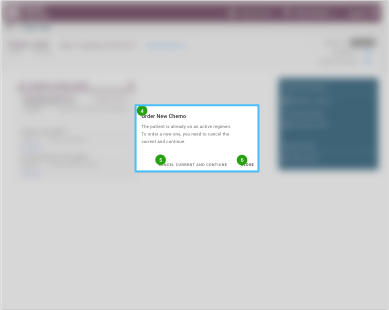
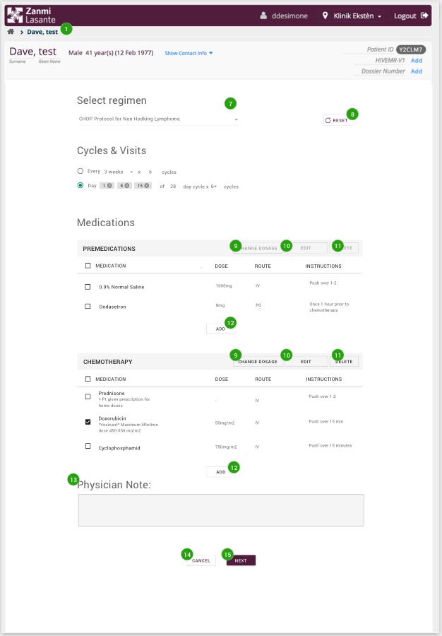

# Read me Mockups - Order chemo
All screens have a name and a background description. The background description often describe the scenario of how to get to the screen and any preconditions to get there.

All screens are marked with green circles with numbers in them. All numbers point to a functionality that is described under the heading "functionalities" for each section.

---

**Page 1 – Cancer Dashboard** The user has chosen a patient that is enrolled to the oncology program and navigates to the Cancer dashboard.

Functionalities:
1. In the breadcrumb see the name of the page.
2. In the “Current enrollment”-box see that the patient is enrolled to the oncology program. 
3. Use the link “Order chemo” to get to the order chemo page. 
 

---

**Page 2 – Order New Chemo** The patient can only have one active regimen at the time. If the patient already has an active regimen the user will receive a pop-up. 

Functionalities:

4. A pop-up appears, informing the user that a regimen for the patient already exists. 

5. The option to cancel the existing regimen and order a new one for the patient. 

6. Close the pop-up and come back to the chemo dashboard again. 
 

---

**Page 3 – Page 3 – Order Chemo** When pressing the “Order chemo”-link on the cancer dashboard or choosing “Cancel current and continue” option on the pop-up the doctor lands on the order chemo page. 

Functionalities:

1.	Choose between 12 different predefined regiments. At any time before pressing submit, change to another regiment. Changes done to one regiment are automatically saved. 

2.	Changes done to a regiment can be reset to the default by using the reset button. 

For all predefined regimens, the following will be predefined: 
- Cycles & Visits, When the medication should be given and for how many cycles. 
- List of all pre-medications included in the chosen regimen. The name, dose, route & instructions for every premedication in the list.  
- List of all chemotherapy medication included in the chosen regimen. The name, dose, route & instructions for every chemotherapy medication in the list.

3.	Select one or more of the medications in the regiment and change dosage on it (them).  

4.	By selecting an individual medication, edit the information about the selected medication. 

5.	Select one or more of the medications in the regiment and delete it (them).  

6.	Add a new pre- and chemotherapy medication 

7.	Add free-text about the chemo order. The free-text written will be showed on all cycles in the regimen. 

8.	Press cancel and get back to the Chemo Dashboard and nothing that was done will be saved. 

9.	Press next and get to the review page of the chemo order. 
 

---
