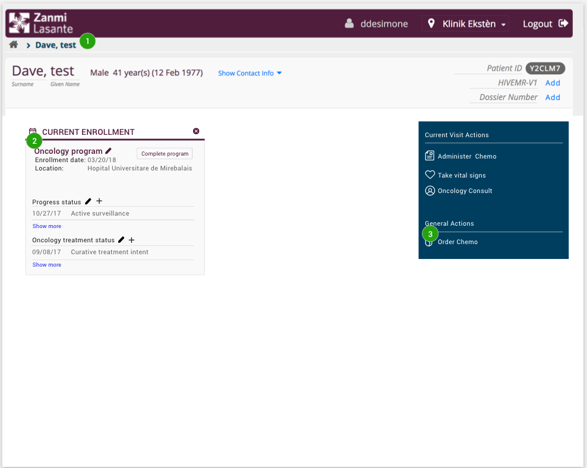

# Read me Mockups - Order chemo
All screens have a name and a background description. The background description often describe the scenario of how to get to the screen and any preconditions to get there.

All screens are marked with green circles with numbers in them. All numbers point to a functionality that is described under the heading "functionalities" for each section.

---

**Page 1 – Cancer Dashboard** The user has chosen a patient that is enrolled to the oncology program and navigates to the Cancer dashboard.

Functionalities:
1. In the breadcrumb see the name of the page.
2. In the “Current enrollment”-box see that the patient is enrolled to the oncology program. 
3. Use the link “Order chemo” to get to the order chemo page. 
 

---

**Page 2 – Order New Chemo** The patient can only have one active regimen at the time. If the patient already has an active regimen the user will receive a pop-up. 

Functionalities:

4. A pop-up appears, informing the user that a regimen for the patient already exists. 

5. The option to cancel the existing regimen and order a new one for the patient. 

6. Close the pop-up and come back to the chemo dashboard again. 
 

---
